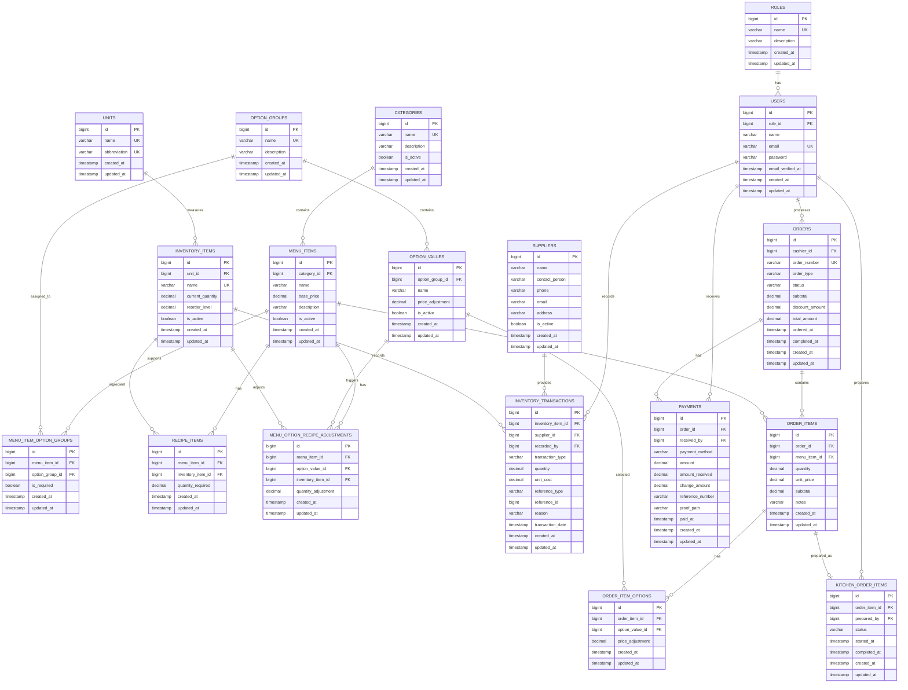

## Database ERD

```mermaid
erDiagram

    %% =========================================
    %% USER MANAGEMENT
    %% =========================================

    ROLES {
        bigint id PK
        varchar name UK
        varchar description
        timestamp created_at
        timestamp updated_at
    }

    USERS {
        bigint id PK
        bigint role_id FK
        varchar name
        varchar email UK
        varchar password
        timestamp email_verified_at
        timestamp created_at
        timestamp updated_at
    }


    %% =========================================
    %% MENU MANAGEMENT
    %% =========================================

    CATEGORIES {
        bigint id PK
        varchar name UK
        varchar description
        boolean is_active
        timestamp created_at
        timestamp updated_at
    }

    MENU_ITEMS {
        bigint id PK
        bigint category_id FK
        varchar name
        decimal base_price
        varchar description
        boolean is_active
        timestamp created_at
        timestamp updated_at
    }


    %% =========================================
    %% MENU OPTIONS
    %% =========================================

    OPTION_GROUPS {
        bigint id PK
        varchar name UK
        varchar description
        timestamp created_at
        timestamp updated_at
    }

    OPTION_VALUES {
        bigint id PK
        bigint option_group_id FK
        varchar name
        decimal price_adjustment
        boolean is_active
        timestamp created_at
        timestamp updated_at
    }

    MENU_ITEM_OPTION_GROUPS {
        bigint id PK
        bigint menu_item_id FK
        bigint option_group_id FK
        boolean is_required
        timestamp created_at
        timestamp updated_at
    }


    %% =========================================
    %% INVENTORY
    %% =========================================

    UNITS {
        bigint id PK
        varchar name UK
        varchar abbreviation UK
        timestamp created_at
        timestamp updated_at
    }

    INVENTORY_ITEMS {
        bigint id PK
        bigint unit_id FK
        varchar name UK
        decimal current_quantity
        decimal reorder_level
        boolean is_active
        timestamp created_at
        timestamp updated_at
    }


    %% =========================================
    %% RECIPES
    %% =========================================

    RECIPE_ITEMS {
        bigint id PK
        bigint menu_item_id FK
        bigint inventory_item_id FK
        decimal quantity_required
        timestamp created_at
        timestamp updated_at
    }

    MENU_OPTION_RECIPE_ADJUSTMENTS {
        bigint id PK
        bigint menu_item_id FK
        bigint option_value_id FK
        bigint inventory_item_id FK
        decimal quantity_adjustment
        timestamp created_at
        timestamp updated_at
    }


    %% =========================================
    %% SUPPLIERS
    %% =========================================

    SUPPLIERS {
        bigint id PK
        varchar name
        varchar contact_person
        varchar phone
        varchar email
        varchar address
        boolean is_active
        timestamp created_at
        timestamp updated_at
    }


    %% =========================================
    %% INVENTORY TRANSACTIONS
    %% =========================================

    INVENTORY_TRANSACTIONS {
        bigint id PK
        bigint inventory_item_id FK
        bigint supplier_id FK
        bigint recorded_by FK

        varchar transaction_type
        decimal quantity
        decimal unit_cost

        varchar reference_type
        bigint reference_id

        varchar reason

        timestamp transaction_date
        timestamp created_at
        timestamp updated_at
    }


    %% =========================================
    %% ORDERS
    %% =========================================

    ORDERS {
        bigint id PK
        bigint cashier_id FK

        varchar order_number UK

        varchar order_type
        varchar status

        decimal subtotal
        decimal discount_amount
        decimal total_amount

        timestamp ordered_at
        timestamp completed_at

        timestamp created_at
        timestamp updated_at
    }


    ORDER_ITEMS {
        bigint id PK
        bigint order_id FK
        bigint menu_item_id FK

        decimal quantity
        decimal unit_price
        decimal subtotal

        varchar notes

        timestamp created_at
        timestamp updated_at
    }


    ORDER_ITEM_OPTIONS {
        bigint id PK
        bigint order_item_id FK
        bigint option_value_id FK

        decimal price_adjustment

        timestamp created_at
        timestamp updated_at
    }


    %% =========================================
    %% KITCHEN / BAR
    %% =========================================

    KITCHEN_ORDER_ITEMS {
        bigint id PK
        bigint order_item_id FK
        bigint prepared_by FK

        varchar status

        timestamp started_at
        timestamp completed_at

        timestamp created_at
        timestamp updated_at
    }


    %% =========================================
    %% PAYMENTS
    %% =========================================

    PAYMENTS {
        bigint id PK
        bigint order_id FK
        bigint received_by FK

        varchar payment_method

        decimal amount
        decimal amount_received
        decimal change_amount

        varchar reference_number
        varchar proof_path

        timestamp paid_at

        timestamp created_at
        timestamp updated_at
    }


    %% =========================================
    %% RELATIONSHIPS
    %% =========================================


    ROLES ||--o{ USERS : has


    USERS ||--o{ ORDERS : processes
    USERS ||--o{ PAYMENTS : receives
    USERS ||--o{ INVENTORY_TRANSACTIONS : records
    USERS ||--o{ KITCHEN_ORDER_ITEMS : prepares


    CATEGORIES ||--o{ MENU_ITEMS : contains


    OPTION_GROUPS ||--o{ OPTION_VALUES : contains


    MENU_ITEMS ||--o{ MENU_ITEM_OPTION_GROUPS : supports

    OPTION_GROUPS ||--o{ MENU_ITEM_OPTION_GROUPS : assigned_to


    UNITS ||--o{ INVENTORY_ITEMS : measures


    MENU_ITEMS ||--o{ RECIPE_ITEMS : has

    INVENTORY_ITEMS ||--o{ RECIPE_ITEMS : ingredient


    MENU_ITEMS ||--o{ MENU_OPTION_RECIPE_ADJUSTMENTS : has

    OPTION_VALUES ||--o{ MENU_OPTION_RECIPE_ADJUSTMENTS : triggers

    INVENTORY_ITEMS ||--o{ MENU_OPTION_RECIPE_ADJUSTMENTS : adjusts


    SUPPLIERS ||--o{ INVENTORY_TRANSACTIONS : provides

    INVENTORY_ITEMS ||--o{ INVENTORY_TRANSACTIONS : records


    ORDERS ||--o{ ORDER_ITEMS : contains

    MENU_ITEMS ||--o{ ORDER_ITEMS : ordered


    ORDER_ITEMS ||--o{ ORDER_ITEM_OPTIONS : has

    OPTION_VALUES ||--o{ ORDER_ITEM_OPTIONS : selected


    ORDER_ITEMS ||--o| KITCHEN_ORDER_ITEMS : prepared_as


    ORDERS ||--o{ PAYMENTS : has
```
