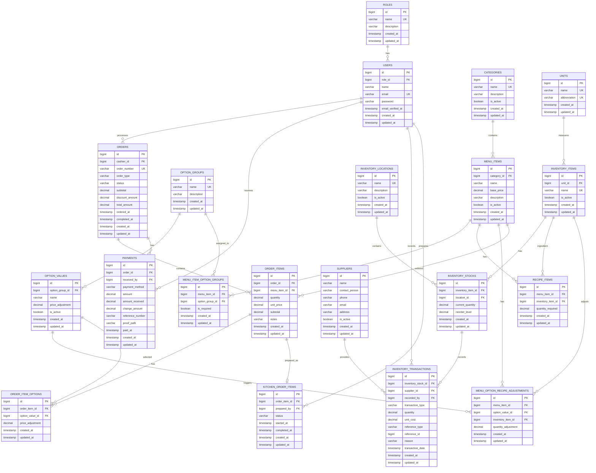
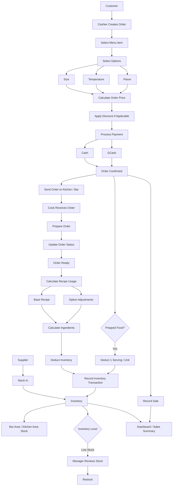

# The Brewing Bar — POS and Inventory Management System

A Laravel-based point-of-sale and inventory management system for The Brewing Bar. This README explains how to clone the repository and run the project locally.

## Getting Started

### Requirements

Install the following before setting up the project:

- Git
- PHP 8.2 or compatible with the project
- Composer
- Node.js and npm
- MySQL (XAMPP can be used on Windows)

### 1. Clone the GitHub repository

Open Git Bash, PowerShell, or a terminal and run:

```bash
git clone git@github.com:lzaragosa555459-eng/ProjectTBB.git
```

If you have not configured an SSH key for GitHub, you can use HTTPS instead:

```bash
git clone https://github.com/lzaragosa555459-eng/ProjectTBB.git
```

Enter the project folder:

```bash
cd ProjectTBB
```

### 2. Install PHP dependencies

```bash
composer install
```

### 3. Create your environment file

Copy the example environment file:

**Windows PowerShell**
```powershell
Copy-Item .env.example .env
```

**Git Bash / macOS / Linux**
```bash
cp .env.example .env
```

Generate the Laravel application key:

```bash
php artisan key:generate
```

### 4. Create and configure the database

1. Start MySQL using XAMPP or your installed MySQL service.
2. Create a database named `thebrewingbar` (or choose another name).
3. Open the `.env` file and update the database settings to match your local MySQL configuration. For a typical local XAMPP setup, the values are:

```dotenv
DB_CONNECTION=mysql
DB_HOST=127.0.0.1
DB_PORT=3306
DB_DATABASE=thebrewingbar
DB_USERNAME=root
DB_PASSWORD=
```

If your MySQL account has a password or uses a different port, enter those values instead.

### 5. Run database migrations

```bash
php artisan migrate --seed
```

This creates the database tables and runs the seeders included in the repository. If you only want to create the tables without seed data, use:

```bash
php artisan migrate
```

### 6. Install frontend dependencies

```bash
npm install
```

For a production-style compiled frontend build:

```bash
npm run build
```

During development, you can instead keep Vite running in a separate terminal:

```bash
npm run dev
```

### 7. Start the Laravel development server

In another terminal, run:

```bash
php artisan serve
```

Open the local URL shown in the terminal (usually `http://127.0.0.1:8000`) in your browser.

## Common Setup Notes

- Do not commit your `.env` file or share its database credentials. It contains local environment settings and secrets.
- If you pull new changes that include dependency updates, run `composer install` and/or `npm install` again as needed.
- If you encounter cached configuration issues after editing `.env`, run:

```bash
php artisan config:clear
```

- If migrations fail because tables already exist, check whether you are using an existing database before trying to rerun or reset migrations. Avoid `php artisan migrate:fresh` on any database containing data you need; it drops all tables.

## Project Design and Documentation

## Database ERD



## System Process



## UI DESIGN

[View the current UI interface in Figma](https://www.figma.com/design/gMAAZ9Zmgib7U5i35lr7Ni/The-Brewing-Bar-Wirefram?node-id=0-1&t=m43ypRmgkDD7Qbh2-1)
